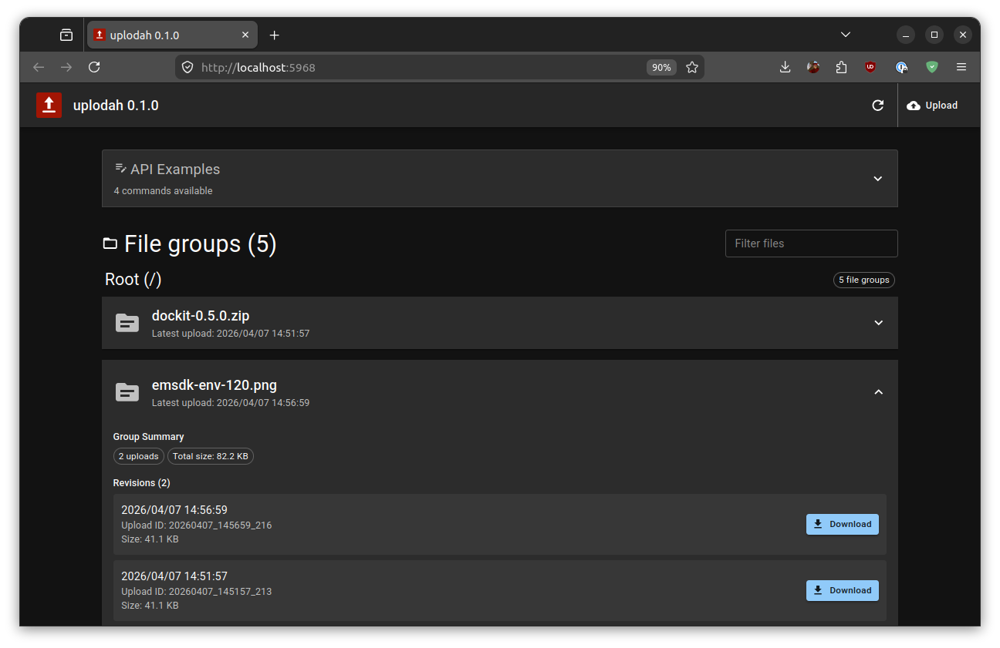
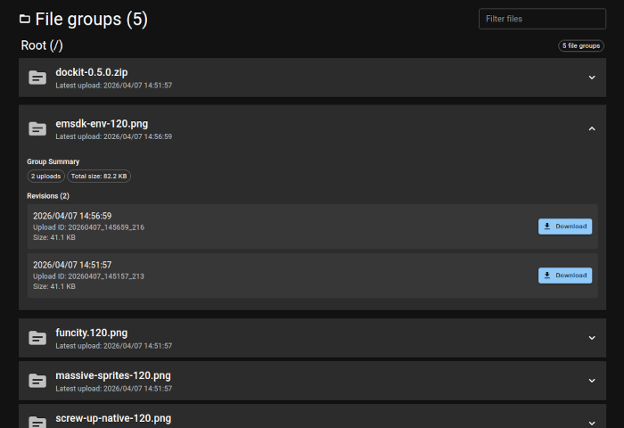
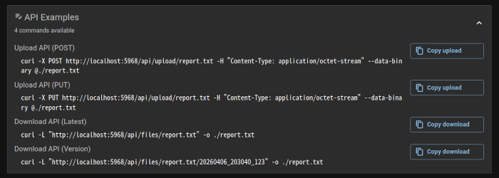
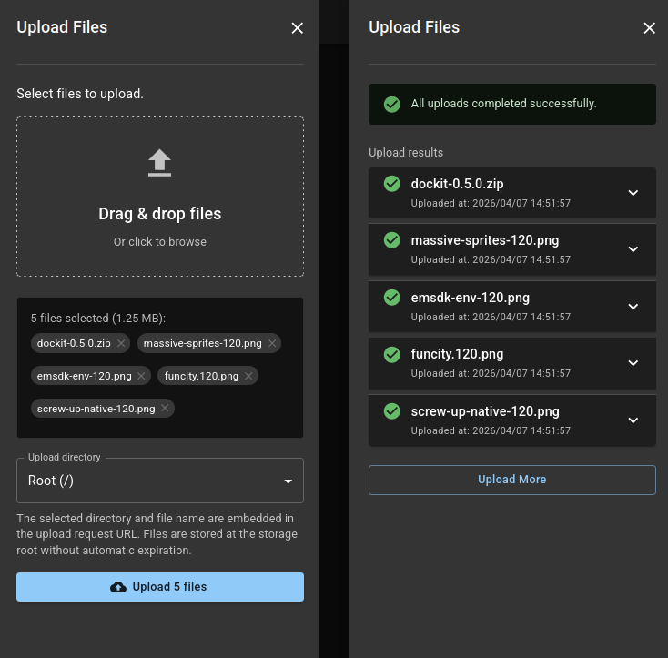
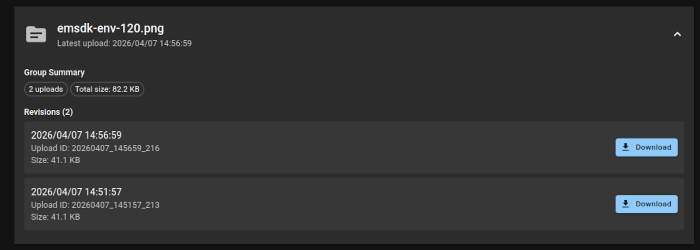

# uplodah

Simple and modern universal file upload/download server implementation


[](https://www.repostatus.org/#wip)
[](https://opensource.org/licenses/MIT)
[](https://www.npmjs.com/package/uplodah)
[](https://hub.docker.com/r/kekyo/uplodah)

---

[(For Japanese language/日本語はこちら)](./README_ja.md)

> Please note that this English version of the document was machine-translated and then partially edited, so it may contain inaccuracies.
> We welcome pull requests to correct any errors in the text.

(Document still under construction!)

## What Is This?

There are many situations, especially in private environments, where you want to host simple file exchange on your own server.
Sharing files with friends, small-office coworkers, or even customers often falls into this category.

Today, cloud storage is the common answer.
At the same time, placing confidential files in cloud storage, even temporarily, may feel uncomfortable, or may be prohibited by strict organizational policy.

So how do you handle simple file upload and download without turning it into a large infrastructure task?
Do you prepare Apache or Nginx, manually tune it, enable WebDAV, then decide what clients should use and how users will browse the stored files?

This "uplodah" may be what you are looking for.
It is a simple server implementation built on Node.js, focused specifically on uploading and downloading files.

Setup is very easy, and zero-config operation is possible in many cases.
There is no database to manage.
If you need backups, just copy the storage subdirectory as files.
Restoring it is equally straightforward and does not require any special tooling.

It also provides a modern browser-based UI:



- Browse uploaded files.
- Search and organize them by file name or virtual directory.
- Check download URLs for the latest version or a specific version.
- Upload multiple files with drag and drop.
- Copy ready-to-use `curl` API examples from the UI.

### Key Features

- **Quick setup, start an upload server in seconds**
- No database required: uploaded files and metadata are managed directly on the filesystem
- Simple upload API: just send `application/octet-stream` with `POST` or `PUT`
- Revisioned storage: re-uploading the same file name keeps history
- Flexible downloads: retrieve either the latest revision or a specific upload ID directly
- Modern Web UI:
  - File list, search, and expandable revision view
  - Sectioned display by virtual directory
  - Multiple file upload
  - Copyable API command examples
- Virtual storage rules:
  - Per-directory read-only control
  - Per-directory expiration rules
- Supports reverse proxies and subpath hosting
- Health check endpoint at `/health`

## Requirements

Node.js 20.19.0 or later

Used stack: Node.js, TypeScript, Vite, Vitest, prettier-max, screw-up, Fastify, React, React MUI, dayjs, JSON5, async-primitives

---

## Installation

If [Node.js](https://nodejs.org/ja/download) is not installed on your system yet, install it first.

```bash
$ node --version
v24.11.1
```

Once Node.js is available, install `uplodah` with npm:

```bash
$ npm install -g uplodah

added 157 packages in 8s

42 packages are looking for funding
  run `npm fund` for details
```

You can also run it directly via `npx`:

```bash
$ npx uplodah
Need to install the following packages:
uplodah@0.1.0
Ok to proceed? (y)

[uplodah]: [2026/04/07 14:25:56.966]: [info]: uplodah [0.1.0] Starting...
[uplodah]: [2026/04/07 14:25:56.967]: [info]: Config file: ./config.json
[uplodah]: [2026/04/07 14:25:56.967]: [info]: Port: 5968
[uplodah]: [2026/04/07 14:25:56.967]: [info]: Base URL: http://localhost:5968 (auto-detected)
[uplodah]: [2026/04/07 14:25:56.967]: [info]: Storage directory: ./storage

    :
    :
```

## Usage

Here are a few examples:

```bash
# Start the server on the default port 5968
uplodah

# Custom port and storage directory
uplodah --port 3000 --storage-dir ./storage

# Fix the public base URL behind a reverse proxy
uplodah --base-url https://files.example.com/uplodah

# Combine multiple options
uplodah --port 3000 \
  --storage-dir ./storage \
  --config-file ./config.json \
  --max-upload-size-mb 500
```

By default, the following URLs are available:

- Web UI: `http://localhost:5968/`
- File listing API: `http://localhost:5968/api/files`
- Upload API: `http://localhost:5968/api/upload/<file-name>`
- Download API: `http://localhost:5968/api/files/<file-name>`
- Health check: `http://localhost:5968/health`

When `--base-url` is specified, the UI-generated download URLs and API command examples use that URL as their base.

`--config-file` points to the configuration file and is useful when you want more detailed customization.
The file is optional. If the default behavior works for you, you do not need it.

### Web UI

The Web UI is user-friendly and includes file browsing per directory, file filtering, upload support, and ready-to-copy `curl` usage examples:



The UI also shows upload and download examples using `curl`, which makes CLI integration straightforward:



### Uploading Files

You can upload files from the UI.
It supports drag and drop and makes uploading multiple files at the same time very easy:



You can also upload files through the API.
The following example uploads `report.txt` into the root directory with `curl`:

```bash
curl -X POST http://localhost:5968/api/upload/report.txt \
  -H "Content-Type: application/octet-stream" \
  --data-binary @./report.txt
```

You can do the same with `PUT`:

```bash
curl -X PUT http://localhost:5968/api/upload/report.txt \
  -H "Content-Type: application/octet-stream" \
  --data-binary @./report.txt
```

When the upload succeeds, the server returns `201 Created`.
The response body includes the stored `uploadId` and generated download URLs.
The `Location` header is also set to the download target.

TODO: Add a JSON response example.

### Uploading into Virtual Directories

If `storage` rules are configured, you can upload files into virtual subdirectories.
In the UI, the target directory is selected from the dropdown in the upload panel.

When using the API, include the subdirectory path in the request URL.
The following example stores `report.txt` under `/foobar`:

```bash
curl -X POST http://localhost:5968/api/upload/foobar/report.txt \
  -H "Content-Type: application/octet-stream" \
  --data-binary @./report.txt
```

This API path is treated as the public file name `/foobar/report.txt`.

Notes:

- If `storage` is not configured, only plain file names such as `report.txt` are allowed.
- If `storage` is configured, uploadable directories are limited to paths defined there.
- Paths containing special characters should be encoded per URL segment.

### Downloading Files

To download a file from the UI, open the entry from the file list and click the "Download" button for the desired version.
As described earlier, `uplodah` can store multiple versions of the same file.
Those revisions are distinguished by upload timestamp, and the list is shown from newest to oldest:



When using `curl`, you also need to specify which version to download.
The precise value is returned in the JSON response from the upload API, but if you know the timestamp-based ID, you can construct the URL directly.

Download the latest version by file name only:

```bash
curl -L "http://localhost:5968/api/files/report.txt" -o ./report.txt
```

Download a specific version in `YYYYMMDD_HHmmss_fff` format:

```bash
curl -L "http://localhost:5968/api/files/report.txt/20260406_203040_123" -o ./report.txt
```

Note that if multiple uploads happen at exactly the same timestamp, the version identifier may gain a suffix such as `_1`, `_2`, and so on.

### File Listing

To fetch the file list with `curl`:

```bash
curl "http://localhost:5968/api/files?skip=0&take=20"
```

The listing API returns groups sorted by most recent upload first.
Each group contains all revisions for that file name.

---

## File Storage Configuration

### Storage Location

By default, uploaded files are stored under `./storage`.
You can change this with the `--storage-dir` option or the `storageDir` setting:

```bash
# Use the default ./storage directory
uplodah

# Use a custom directory
uplodah --storage-dir /srv/uplodah/storage
```

Relative paths provided via CLI options or environment variables are resolved from the current working directory.
`storageDir` inside `config.json` is resolved relative to the directory containing that `config.json`.

### Storage Layout

As described above, `uplodah` does not use any special database.
It only places directories and files under the storage directory.

Each uploaded file has a neighboring `metadata.json`.
In the current version, that file always contains `"{}"` and does not hold additional details yet, but note that the upload is not recognized unless that file exists.

When `storage` rules are not used, a history directory is created for each file name:

```text
storage/
└── report.txt/
    ├── 20260406_203040_123/
    │   ├── metadata.json
    │   └── report.txt
    └── 20260406_204512_918/
        ├── metadata.json
        └── report.txt
```

When `storage` rules are configured, the layout switches to an internally managed tree:

```text
storage/
└── .uplodah/
    └── groups/
        ├── root/
        │   └── report.txt/
        │       └── 20260406_203040_123/
        │           ├── metadata.json
        │           └── report.txt
        └── tree/
            └── dropbox/
                └── report.txt/
                    └── 20260406_204512_918/
                        ├── metadata.json
                        └── report.txt
```

`uploadId` values are generated from timestamps in `YYYYMMDD_HHmmss_SSS` format.
If multiple uploads collide within the same millisecond, a sequence suffix is appended.

### Virtual Directory Rules

You can define rules for virtual directories in `config.json`.
The `storage` section is optional.
If it is not defined, uploads are accepted only at the root with plain file names.

Once `storage: { ... }` is defined, uploads to undefined directories are rejected.
You can also configure behavior per virtual directory.

Here is an example `storage` section in `config.json`:

```json
{
  "port": 5968,
  "storage": {
    "/": {},
    "/foobar": {
      "expireSeconds": 86400
    },
    "/archive": {
      "readonly": true
    },
    "/archive/incoming": {}
  }
}
```

In this example:

- `/` accepts normal uploads
- Uploads under `/foobar` expire automatically after 24 hours
- `/archive` is read-only
- `/archive/incoming` is more specific than `/archive`, so uploads are allowed there again

Rule behavior:

- Keys must always start with `/`
- Backslashes and relative path segments such as `.` and `..` are not allowed
- The most specific matching directory rule is applied
- Once `storage` is defined, uploads to undefined directories are rejected
  To allow uploads at the root directory as well, include `/` explicitly as shown above

### Backup and Restore

Because there is no database, backing up the storage directory is sufficient:

```bash
cd /your/server/base/dir
tar -cf - ./storage | bzip2 -9 > backup-storage.tar.bz2
```

To restore, extract the archive and start `uplodah` again with the same `storageDir` setting.

If the directory structure is damaged, you can rebuild it manually as long as you preserve the required layout:

1. Create a directory in the form `<file-name>/<YYYYMMDD_HHmmss_fff[_num]>/`.
2. Place both `metadata.json` and the payload file into that directory.

If you modify the storage directory directly while `uplodah` is running, those changes are not reflected immediately.
Restart `uplodah` afterward.

---

## Configuration

`uplodah` supports configuration via command-line options, environment variables, and `config.json`.

Settings are applied in the following order, from highest priority to lowest:

1. Command-line options
2. Environment variables
3. `config.json`
4. Default values

## Configuration File Structure

You can specify a custom configuration file:

```bash
# Using a command-line option
uplodah --config-file /path/to/config.json

# Using an environment variable
export UPLODAH_CONFIG_FILE=/path/to/config.json
uplodah
```

If not specified, `uplodah` looks for `./config.json` in the current directory.

`config.json` is parsed as JSON5, so comments and trailing commas are allowed.

### `config.json` Structure

```json
{
  "port": 5968,
  "baseUrl": "https://files.example.com/uplodah",
  "storageDir": "./storage",
  "realm": "Awesome uplodah",
  "logLevel": "info",
  "trustedProxies": ["127.0.0.1", "::1"],
  "maxUploadSizeMb": 500,
  "storage": {
    "/": {},
    "/dropbox": {
      "expireSeconds": 86400
    },
    "/archive": {
      "readonly": true
    }
  }
}
```

All fields are optional.
Only specify the ones you want to override.

Relative `storageDir` paths are resolved from the directory containing `config.json`.

### Configuration Reference Table

All settings are resolved with the priority **CLI > environment variable > config.json > default**.

| CLI option                     | Environment variable           | `config.json` key | Description                                       | Valid values                                 | Default             |
| :----------------------------- | :----------------------------- | :---------------- | :------------------------------------------------ | :------------------------------------------- | :------------------ |
| `-p, --port <port>`           | `UPLODAH_PORT`                 | `port`            | HTTP server listening port                        | 1-65535                                      | `5968`              |
| `-b, --base-url <url>`        | `UPLODAH_BASE_URL`             | `baseUrl`         | Fixed external base URL                           | valid URL                                    | auto-detected       |
| `-d, --storage-dir <dir>`     | `UPLODAH_STORAGE_DIR`          | `storageDir`      | Storage root directory                            | valid path                                   | `./storage`         |
| `-c, --config-file <path>`    | `UPLODAH_CONFIG_FILE`          | N/A               | Path to the configuration file                    | valid path                                   | `./config.json`     |
| `-r, --realm <realm>`         | `UPLODAH_REALM`                | `realm`           | UI title and server label                         | string                                       | `uplodah [version]` |
| `-l, --log-level <level>`     | `UPLODAH_LOG_LEVEL`            | `logLevel`        | Log verbosity                                     | `debug`, `info`, `warn`, `error`, `ignore`   | `info`              |
| `--trusted-proxies <ips>`     | `UPLODAH_TRUSTED_PROXIES`      | `trustedProxies`  | Comma-separated trusted proxy IP list             | list of IP addresses                         | none                |
| `--max-upload-size-mb <size>` | `UPLODAH_MAX_UPLOAD_SIZE_MB`   | `maxUploadSizeMb` | Maximum upload size in MB                         | 1-10000                                      | `100`               |
| N/A                           | N/A                            | `storage`         | Per-virtual-directory storage policy              | object                                       | unset               |

---

## Reverse Proxy Interoperability

The server is designed to run behind a reverse proxy.
For example, you may want to expose it at `https://files.example.com/uplodah` while the Node.js server itself runs on another host or port internally.

### URL Resolution

The server resolves its public URL with the following priority:

1. Fixed base URL: `--base-url` or `baseUrl`
2. `Forwarded` header
3. `X-Forwarded-Proto`, `X-Forwarded-Host`, and `X-Forwarded-Port`
4. Normal `Host` header

For subpath hosting, the path prefix can be resolved in one of these ways:

- Include the path in `baseUrl`
- Send the `X-Forwarded-Path` header

The most reliable option is to fix `baseUrl` explicitly:

```bash
uplodah --base-url https://files.example.com/uplodah
```

In that case, the public URLs look like this:

- Web UI: `https://files.example.com/uplodah/`
- File listing API: `https://files.example.com/uplodah/api/files`
- Download API: `https://files.example.com/uplodah/api/files/report.txt`

If you want to explicitly define trusted proxies, configure `trustedProxies`:

```bash
uplodah --trusted-proxies "10.0.0.10,10.0.0.11"
```

You can provide the same values via environment variables:

```bash
export UPLODAH_BASE_URL=https://files.example.com/uplodah
export UPLODAH_TRUSTED_PROXIES=10.0.0.10,10.0.0.11
export UPLODAH_CONFIG_FILE=/srv/uplodah/config.json
export UPLODAH_STORAGE_DIR=/srv/uplodah/storage
export UPLODAH_MAX_UPLOAD_SIZE_MB=500
```

---

## Notes

### Authentication

The current version of `uplodah` does not implement authentication.
If you expose it on a public network, add protection such as Basic authentication, OIDC, or IP restrictions on the reverse proxy or gateway side.

### Health Check

`/health` returns a response like this:

```json
{
  "status": "ok",
  "version": "0.1.0"
}
```

### UI Availability

If the UI build is not found in the runtime environment, the root Web UI at `/` is disabled, but the upload, listing, and download API routes remain available.

## TODO

- Supports authentication.
- Supports Docker images.

## Other

This server project is a sister project of [nuget-server](https://github.com/kekyo/nuget-server/).

## License

Under MIT.
